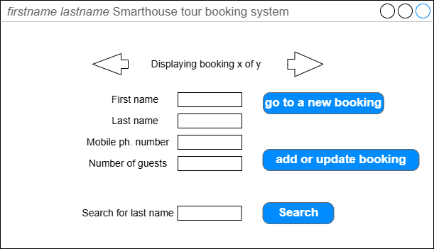

# Step 4

To complete this step you will add a GUI interface using tkinter. 

Much of the code from step 3 will remain the same. The class Booking should be able 
to remain unchanged. Many of the other functions will need at least some change.

The interface will require a single window, with all widgets within that window, as
per the following diagram. 

### The program will operate in the following manner

When the program starts it will read existing bookings from the bookings.csv file.
Where there is at least one booking, the program should sort the list based on 
lastname and then display the first 
record in the list. At this stage the program should also update the text on the
display which shows "Displaying booking of x of y", so that x is replaced with 1 and 
y is replaced with the total number of bookings.

The forward and backward arrows should be implemented with code so that user can 
move backwards through the bookings, without causing the program to error.

When the "go to a new booking" button is clicked it should 
clear the entry widgets and change the text 
"Displaying booking of x of y" with "Enter a new booking". As your program
also needs to keep track of the record being displayed to assist with the 
backward and forward arrow functionality, it is likely a good idea to 
adjust the displayed pointer index to be 1 greater than the current last 
booking. 

When the "add or update booking" button is clicked the program 
will attempt to either
update the new record details that have been entered or add the new record. Where the
add or update is successful the list can be re-sorted, and saved to the CSV file. The 
GUI interface should display either the new booking or the first booking, 
and the text "Displaying booking of x of y" should be updated to reflect what has
changed.

When the "Search" button is clicked, the program should search through the bookings
for the first match to the name, being searched for. And then that record shold 
become the current record that is displayed.

Save your completed file as **step4*firstamelastname*.py** - where _firstname_ is your first 
name and _lastname_ is your lastname. 

Return to [index](../README.md)